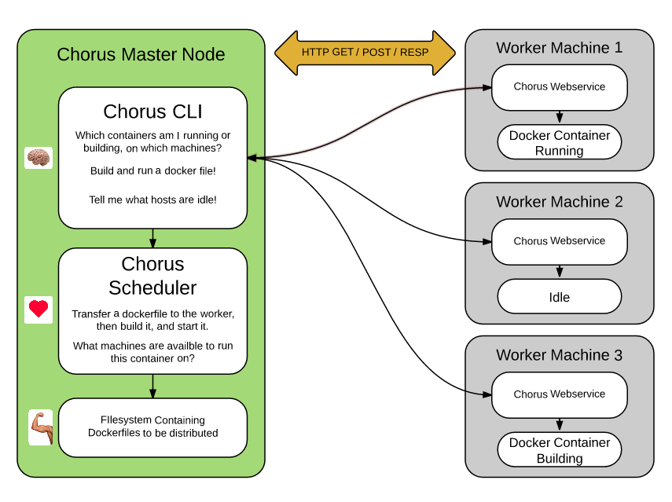

# chorus

Chorus is a project for the [Docker Community Hackthon](https://www.docker.com/community/hackathon).
It has it's roots in a container scheduler called [Orchestra](https://github.com/niall-byrne/orchestra).

### Use Case

*Chorus is a tool for distributing dockerfiles to a cluster of machines to build, run, and test containers.* 
You might describe it as a container build-farm.

Without relying on [dockerhub](https://hub.docker.com/), it gives you the abiliity to easily distribute docker containers accross your infrastructure.  I would imagine it would be most useful for folks who don't wish to host containers elsewhere, or for folks who would like to setup a test environment.  The key concept is that you distribute dockerfiles themselves, as opposed to containers- and you build from scratch each time you run.

Chorus allows you to embed 'docker run command-line arguments' into the Dockerfiles themselves, take a look at the example dockerfiles to get a feel for how this works.  It's probably, at most, a handy way to handle port mappings, but you may find other creative uses.

 

 

[Infrastructure Setup Guide](docs/PROVISION.md) 
[Installation Guide](docs/INSTALL.md) 
[Example Command Line Use](docs/EXAMPLE.md) 

