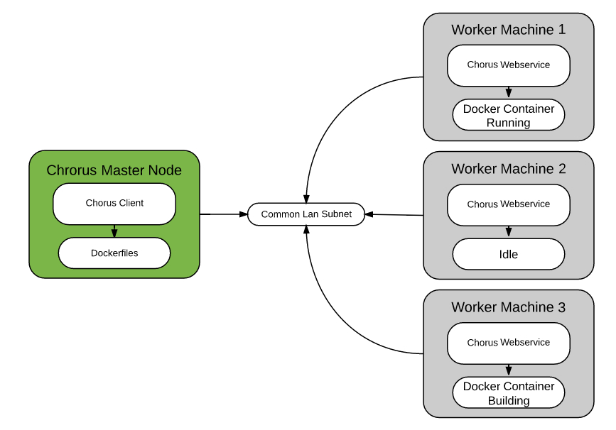

## Provisioning Your Fleet

The use case for Chorus assumes a couple of things about the architecture of your environment.  If you set up your workers in this manner, you will able to make use of them quickly with Chorus.

(The Chorus scripts themselves are quite cross-distro compatible and make simple system calls to interact with docker, but the provisioning scripts and ansible playbooks are all written to be compatible with Ubuntu 14.04 in the interest of saving time.)



-  Your worker machines should exist on one secure, common LAN subnet.  In AWS, this would be a VPC shared by all     machines.  This allows for intermachine communication in a method that's much more secure than traversing the      public internet.

-  SUDO configuration.  Following the traditional cloud model, there is an 'ubuntu' user installed on EC2 AMI's       that has NOPASSWD sudo access.  The Chorus webservice needs to be run by a user that has this same SUDO access,    and is also in the docker user group.  The SUDO access is simply required to allow the Ansible playbooks to        install the webservice as a system service, but this dependency can be removed easily later.  Ensure you are       using the same user accross your fleet, and ensure it has both NOPASSWD sudo with ```visudo``` and that it is      also in the docker administration group to allow this user to manage containers (```sudo usermod -aG docker <USERNAME>```).  The Chorus webservice will run    under this account.
    
-  Each worker will run Ubuntu 14.04 (to make it compatible with the current playbooks, it's quite easy to modify     the playbooks to support other Distros, but for the sake of getting you up quickly Ubuntu is recommended.)
   If you were provisioning EC2 instances, simply create an AMI of an Ubuntu machine with docker installed, and       spawn a few instances on the same VPC.

-  One machine will act as the master.  This will be the machine you log into to control your fleet, and you will     keep the Chorus git repo here.  You will also keep your collection of dockerfiles here to distribute to your       fleet.  This machine should also be an Ubuntu 14.04 machine to allow the setup scripts to run without         
   modification.

