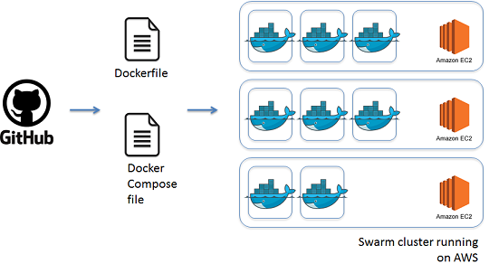
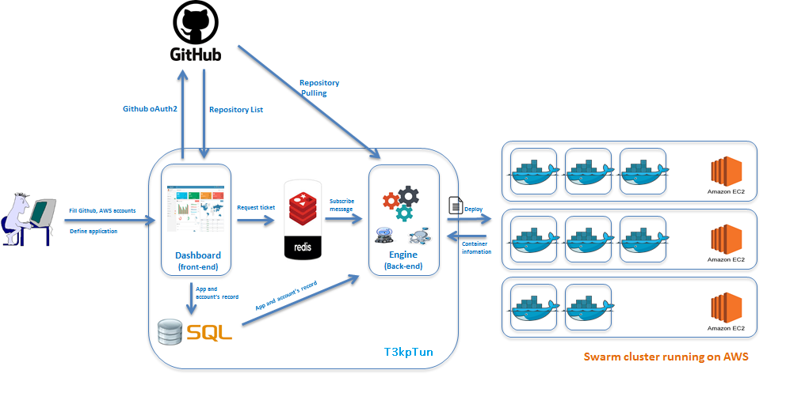

# [T3kpTun](https://github.com/dockerhn/GHD3/) 
###A simple way for dockerizing your applications

## What is it?

* Starting from your github repository, t3kpTun trys to generate Dockerfile describing how to package your source code application. We define the input form in which you could figure out various parameters for the application including webserver (Apache or Tomcat), dependencies, TCP ports, linked services, etc. 
* t3kpTun supports Dockerfile and Docker compose editor directly from browser so that you could find easily to review and update these generated files if needed.
* Then, t3kpTun helps to deploy these bundle of your audited files and source code into pre-deployed Swarm cluster under your AWS account.
* t3kpTun automatically saves both of Dockerfile and Docker compose file for versioning and re-using purpose.
* t3kpTun supports historical view on your past deployments and building log. You could easily copy a previous deployment by one-click.

##Targeted User

Developers or Technical staffs:
* Want to run their source code (Github) with Docker native technologies on Public Cloud (AWS, Azure,..) or Private Cloud (Openstack, Vmware vCloud,...)
* Have the source code (Github) but don't have or have a little knowledges about Docker before.
* Look for a simplest way to deploy app on Docker with best practice from Docker Experts

##Architecture

Our application is a SaaS (it is an EC2 Instance) with 2 main modules:

##### Front-End module
   
Provide WebUI and Dashboard to create and manage your application with T3kpTun. Now, It include:
   * WebUI with simple steps to deploy and manage User's applications (with Next buttons)
   * User registering Page
   * Single sign-on User accounts with Github, AWS Accounts
   * User can create file templates for: Dockerfile, Compose file via Web Browsers or use predifined templates 
   * Call to Back-end module to execute steps: deploy apps, get logs(Container's stdout, deployment Logs) and application      health checking

##### Back-End module

All tasks to deploy and manage your application on Public Cloud will be implemented by the back-end modules. They does some functions:
   * Receiving Request from front-end to generate Dockerfile, Compose file. and then automatically build image, orchestrate user app via Docker Compose to Pubic Cloud
   * Using DOcker machine to build Docker Environment on Public Cloud
   * Orchestrating, monitoring user applications and logs checking on Docker Swarm with Docker Compose and Machine
   * Provide a request queue with Redis

##### How does T3kpTun work?
T3kpTun is designed to be a minimal, stateless service that is easy to deploy and maintain. The figure below depicts how it works:

##Requirements

1. [Amazon Web Service Account](https://aws.amazon.com/) 
2. [GitHub Account](https://github.com/) 
3. Internet :)

##Getting started
Dockerize your App and Automatic Deployment with T3kpTun

http://ec2-52-74-0-120.ap-southeast-1.compute.amazonaws.com/

####Demo
Please  to view on youtube :) https://youtu.be/HqUIEAXqS4Q

##Local Installation and documentation
* [Font-End module](fe/)
* [Back-End module](be/)

##Next Version
The next version of T3kpTun will have some additional features, like as:
* Support unlimited-tier application with GUI (Now, T3kpTun support only 2 tier, for example: Web & DB tiers)
* Choice swarm-cluster when you deploy multiple applications with T3kpTun
* Push your image to your Dockerhub repository with your account
* Support other Clouds: Openstack, Vmware, Google Cloud Platform, Azure

##Authors

1. Nguyen Sy Thanh Son (https://github.com/thanhson1085)
2. Tran Huu Cuong (https://github.com/tranhuucuong91)
3. Vo Quang Thai (https://github.com/thaivq7985)

T3kpTun is a SaaS, however, you can install locally on your PC

## License - MIT

The T3kpTun code is licensed under the MIT license.

T3kpTun: Copyright (c) 2015 Docker-Ha Noi. http://www.meetup.com/docker-hanoi

Permission is hereby granted, free of charge, to any person obtaining a copy
of this software and associated documentation files (the "Software"), to deal
in the Software without restriction, including without limitation the rights
to use, copy, modify, merge, publish, distribute, sublicense, and/or sell
copies of the Software, and to permit persons to whom the Software is
furnished to do so, subject to the following conditions:

The above copyright notice and this permission notice shall be included in
all copies or substantial portions of the Software.

THE SOFTWARE IS PROVIDED "AS IS", WITHOUT WARRANTY OF ANY KIND, EXPRESS OR
IMPLIED, INCLUDING BUT NOT LIMITED TO THE WARRANTIES OF MERCHANTABILITY,
FITNESS FOR A PARTICULAR PURPOSE AND NONINFRINGEMENT. IN NO EVENT SHALL THE
AUTHORS OR COPYRIGHT HOLDERS BE LIABLE FOR ANY CLAIM, DAMAGES OR OTHER
LIABILITY, WHETHER IN AN ACTION OF CONTRACT, TORT OR OTHERWISE, ARISING FROM,
OUT OF OR IN CONNECTION WITH THE SOFTWARE OR THE USE OR OTHER DEALINGS IN
THE SOFTWARE.
